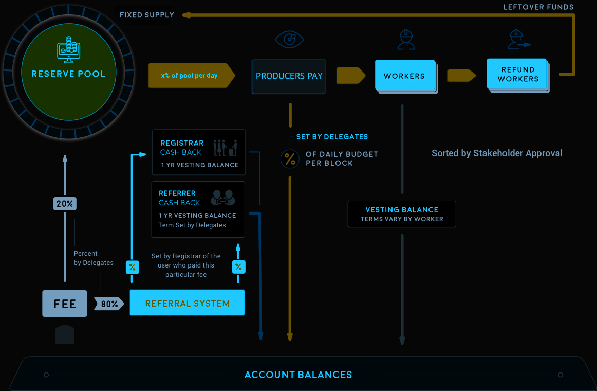

# Indie Protocol

> **Thinking differently** about digital media creators business models

*This documentation is provided as an joint effort of Indie Protocol community on [GitHub](https://github.com/indieprotocol).*

## Problems we aim to solve

- **Copyright laws from centuries ago protecting content creators and artists of the digital media age is not working.**
Digital content properties are different from the conventional media reproduction required for distributing copies of the artists and creators work in the 16th century. Even in the 20th century the physical copies were the basis for distribution of music, publishing, photography and movies.
But now copies are digital. Anyone can create infinite copies of any digital content. Should we continue to look at copies of a art work as something scarce and valuable? What if digital artists and creators are "selling" the wrong product to their fans? Maybe digital copies are not the product...

- **The digital media content train has left the station and it's impossible to revert it's course.**
Digital Rights Management (DRM) platforms and content aggregators like Amazon, Spotify or Apple Music seem to have been a failed attempt at making digital media scarce by restricting it's availability and hiding it behind a pay wall. The result has not been great for the platforms over time, but has become unbearable for the vast majority of artists and creators...

- **What's the value of sand in a desert? But maybe water is very valuable, because of its scarcity.**
We think that until we understand this shift in the digital media availability and distribution, nothing will change in the content creators and artists business results.
But what is scarce in the digital age? And what about the distribution and funding for creative work?

## How we solve them?

> **Let's rethink the business models for the digital age**
> and free our creations from their recording, publishing or distribution artificial prisons.

- **Distribution is almost instant**
And free thanks to the Internet and all open source technology. Can't our creations also be available to all our audience instantly and without fences?

- **Time and attention is scarce**
Indie Protocol is a new business model that leverages the Internet and Blockchain to monetize digital content in new and non-intrusive ways.

- **Collectibles as the magic potion**
But not for intellectual property or copy rights! Fans will also prefer to collect items and get exclusive perks directly from creators.

- **Crowd funding for creators**
This is already a reality, but can be evolved to be tracked via the Blockchain, and even distribute exclusive collectibles to bakers.

- **Digital tickets**
Indie enables artists to sell live performances directly to their fans, and open up their studios or promote their own special events.

- **Exclusive content for super-fans**
Super-fans always wanted their vanity items. With Indie we can think of giving them even more! Actually, the only limit is the imagination...

## What is Indie Protocol?
Indie Protocol is a Blockchain Platform built as [open source code](https://github.com/indieprotocol/indie-core), based on the Industrial-grade [Graphene blockchain core](https://github.com/cryptonomex/graphene), that powered leading networks like [BitShares](https://bitshares.github.io/), [Steemit](https://github.com/steemit) or [EOS.io](https://github.com/eosio). Indie Protocol is the code-base for many Blockchain Networks to be launched and ran by a network of voted block producer nodes (Blockchain nodes) around the world, similar to other DPOS blockchains as an infrastructure. Indie Protocol is not a company, a trademark nor a brand, Indie Protocol doesn't have any legal responsibilities as a platform nor as code; users of Indie Protocol might have responsibilities or legal obligations for using it toward their legal jurisdiction depending on their usage and the means behind it. Our code is released as is, with a MIT license. It's up to the users of our open source code to decide what to do with it. Any Blockchain Network launched using Indie Protocol's code will be launched by their own community, and completely independent from Indie Protocol's core team, as we don't operate any client interfaces, provide any services, provide any channels, internet domains, block producer nodes or API nodes.

## Blockchain as Organization's
Indie Protocol enables the creation of Decentralized “Blockchain as Organization”'s (BaO's), and is built to run high-performance digital content publishing, provision and licensing operations. It enables a Creative Community to launch its core utility token, and holders can decide the Blockchain's future direction in order to develop and maintain a wide range of decentralized digital content publishing, provision using IPFS, licensing and fee distribution. A network that uses Indie Protocol's code is a Blockchain network that permanently records digital media operations between different Blockchain accounts, and facilitates a wide range of digital media distribution controls across the network's users.

## Core Utility Token
Indie Protocol's core token (IND) is the basis for a community to launch their own, enabling to perform operations on the network, as it is used pay the fees to submit transactions over Indie Protocol networks; it is also used for Indie Protocol development purposes; while (IND) core token holders are in power to manage and develop Indie Protocol, to influence its future through several Blockchain integrated built-in decentralized voting functions, and to incentivize developers for their submitted and approved worker proposals. Also to assign committee members for maintaining Blockchain dynamic parameters and vote block producer nodes (Blockchain nodes) that will be validating live transactions.

## Performance and Scalability
Indie Protocol is designed from the ground up to process more transactions every second than VISA and MasterCard combined. Indie Protocol can confirm transactions in an average of just 1 second, limited only by the speed of light. High performance Blockchain technology is necessary for cryptocurrencies and smart contract platforms to provide a viable alternative to existing digital media technology platforms. To achieve this industry-leading performance, Indie Protocol was designed to meet the following:

- Keep everything in memory.
- Keep the core business logic in a single thread.
- Keep cryptographic operations (hashes and signatures) out of the core business logic.
- Divide validation into state-dependent and state-independent checks.
- Use an object oriented data model.

By following these simple rules, Indie Protocol is able to process 100,000 transactions per second without any significant effort devoted to optimization. It should be noted that the performance achieved by Indie Protocol is highly dependent upon having a compatible transaction protocol. It would not be possible to achieve the same level of performance in a protocol where the Core Business Logic is run in a virtual machine that performs cryptographic operations and references all objects with hash identifiers. Blockchains are inherently single-threaded, and the performance of a single core of a CPU is the most limited and least scalable resource of all. Indie Protocol is designed to get the most out of this single thread of execution.

All transactions on cryptocurrency networks depend upon cryptographic signatures to validate permissions. In the general case, the permissions required can change as a result of other transactions. This means that permissions need to be defined in terms that require no cryptographic calculations within the Business Logic Processor. To do this, every public key needs to be assigned a unique and immutable ID. After an ID has been assigned, the Input Disruptor(s) can verify that the signature provided matches the ID specified. By the time the transaction makes it to the Business Logic Processor, the only remaining step is to check the IDs. This same technique can be used to remove pre-condition checking on any immutable object with a static ID.

## Smart Contracts

Many Blockchains are adopting a general purpose scripting language to define all operations. These designs end up defining the “Business Logic Processor” as a virtual machine and all transactions are defined as scripts to be run by the virtual machine. This approach takes the single-threaded limitations of a real CPU and compounds them by forcing everything through a virtual CPU. A virtual CPU, even with Just-In-Time compilation, will always be slower than a real CPU, but pure speed of calculation isn’t the only issue with the “everything is a script” approach. When transactions are defined at such a low level, it means that most of the static checks and cryptographic operations get sucked back into the Business Logic Processing and the overall throughput falls. A scripting engine should never require a cryptographic signature check to be performed even if it is done through a native call. This means it should be optimized with single-threaded performance in mind from the beginning, and that the smart contracts should be supported natively by the Blockchain, instead of running in a virtual machine.

## Conclusion

Indie Protocol is a high-performance Blockchain designed to allow the throughput needed to be able to deal with the large-scale adoption of the major digital content distribution platforms, like YouTube, Spotify, Apple Music, Flickr or Amazon Kindle. The protocol takes care of all the intricacies of the blockchain, decentralized storage (IPFS) and incentivization mechanisms, as well as the core business logic that is content type agnostic, so that other protocols can build on top to tailor it to specific content requirements. This is what Indie Protocol has to offer, PR's welcome! :)

[Join our Discord Server](https://discord.gg/6K8NQJ4pkd)

Indie Protocol GitHub development team:

