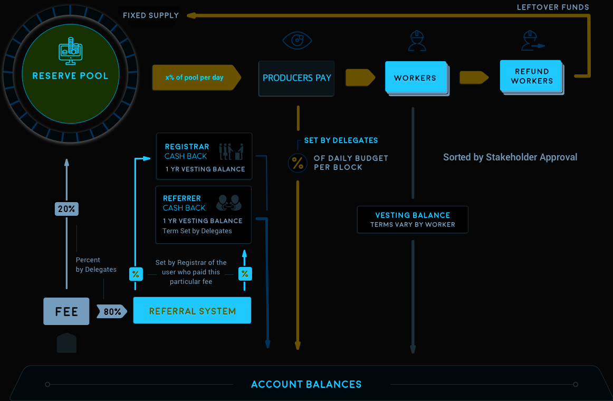

# Indie Protocol Documentation

The contents on this page is provided as an agile effort by Indie Protocol community on [GitHub](https://github.com/indieprotocol).

## Blockchain Identity 
Indie Protocol is a decentralized “Blockchain as Organization” (BaO); an industrial-grade decentralized open source platform built to run high-performance digital content publishing, provision and licensing operations. It represents a decentralized autonomous community that enables its core utility token (IND) holders to decide the Blockchain future direction in order to develop and maintain a wide range of decentralized digital content publishing and provision (IPFS), licensing and fee distribution. Indie Protocol is a Blockchain that permanently records digital media operations between different Blockchain accounts and facilitates a wide range of access controls across Indie Protocol users.

## Core Token
Indie Protocol core token (IND) is the core operations utility which is used as the fee to submit transactions over Indie Protocol; it is also used for Indie Protocol development purposes; while (IND) core token holders are in power to manage and develop Indie Protocol to influence its future through several Blockchain integrated built-in decentralized voting functions in order to issue utility to developers for their submitted and approved worker proposals, also to assign committee members for maintaining Blockchain dynamic parameters and vote block producer nodes (Blockchain nodes) that will be validating live transactions.

## Infrastructure
Indie Protocol is a platform built using an [open source code](https://github.com/indieprotocol/indie-core) and running by voted block producer nodes (Blockchain nodes) around the world, it is similar to Bitcoin as an infrastructure, Indie Protocol is not a company, a trademark nor a brand, Indie Protocol doesn't have any legal responsibilities as a platform nor as code; users of Indie Protocol might have responsibilities or legal obligations for using it toward their legal jurisdiction depending on their usage and the means behind it. Legal entities cannot claim legal responsibilities of an open source code nor a decentralized Blockchain platform, they can operate client interfaces that is interfacing with Indie Protocol and can bind to a legal partnerships for the sake of validating Indie Protocol data or might provide services on top of Indie Protocol platform through their own designed client interfaces which is interfacing with Indie Protocol using their own channels, internet domains, block producer nodes or API nodes.

## Performance and Scalability
Indie Protocol is designed from the ground up to process more transactions every second than VISA and MasterCard combined. Indie Protocol can confirm transactions in an average of just 1 second, limited only by the speed of light. High performance Blockchain technology is necessary for cryptocurrencies and smart contract platforms to provide a viable alternative to existing financial technology platforms. To achieve this industry-leading performance, Indie Protocol was designed to meet the following:

- Keep everything in memory.
- Keep the core business logic in a single thread.
- Keep cryptographic operations (hashes and signatures) out of the core business logic.
- Divide validation into state-dependent and state-independent checks.
- Use an object oriented data model.

By following these simple rules, Indie Protocol is able to process 100,000 transactions per second without any significant effort devoted to optimization. It should be noted that the performance achieved by Indie Protocol is highly dependent upon having a compatible transaction protocol. It would not be possible to achieve the same level of performance in a protocol where the Core Business Logic is run in a virtual machine that performs cryptographic operations and references all objects with hash identifiers. Blockchains are inherently single-threaded, and the performance of a single core of a CPU is the most limited and least scalable resource of all. Indie Protocol is designed to get the most out of this single thread of execution.

All transactions on cryptocurrency networks depend upon cryptographic signatures to validate permissions. In the general case, the permissions required can change as a result of other transactions. This means that permissions need to be defined in terms that require no cryptographic calculations within the Business Logic Processor. To do this, every public key needs to be assigned a unique and immutable ID. After an ID has been assigned, the Input Disruptor(s) can verify that the signature provided matches the ID specified. By the time the transaction makes it to the Business Logic Processor, the only remaining step is to check the IDs. This same technique can be used to remove pre-condition checking on any immutable object with a static ID.

## Transactions Design

Many transaction properties can be checked statically, without the need to reference the current global state. These checks include range checking of parameters, de-duplication of inputs, sort order of arrays, etc. Generally speaking, many checks can be performed if the transaction includes the data it “assumes” about the global state. After these checks are performed, all that is necessary for the Business Logic Processor to do is make sure the “assumptions” are still true, which can usually be boiled down to checking a modification timestamp on objects referenced relative to the time the transaction was signed.

## Smart Contracts

Many Blockchains are adopting a general purpose scripting language to define all operations. These designs end up defining the “Business Logic Processor” as a virtual machine and all transactions are defined as scripts to be run by the virtual machine. This approach takes the single-threaded limitations of a real CPU and compounds them by forcing everything through a virtual CPU. A virtual CPU, even with Just-In-Time compilation, will always be slower than a real CPU, but pure speed of calculation isn’t the only issue with the “everything is a script” approach. When transactions are defined at such a low level, it means that most of the static checks and cryptographic operations get sucked back into the Business Logic Processing and the overall throughput falls. A scripting engine should never require a cryptographic signature check to be performed even if it is done through a native call. Based upon the lessons we learn from LMAX, we know that a virtual machine for a Blockchain should be designed with single-threaded performance in mind. This means it should be optimized for Just-In-Time compilation from the beginning, and that the most frequently used smart contracts should be supported natively by the Blockchain, leaving only the rarely-used custom contracts to run in a virtual machine. These custom contracts should be designed around performance, which means the Virtual Machine should limit the addressable memory to something that will fit within the CPU cache.

## Object Oriented Model

One of the benefits of keeping everything in memory is that the software can be designed to mimic the real-world relationships of data. This means that the Business Logic Processor can quickly follow in-memory pointers to the data it needs, rather than being forced to perform expensive database queries. It also means that data can be accessed without copying it, and that the data can be modified in-place. This single optimization offers an order-of-magnitude performance gain over using a database-based approach.

## Transaction Sizes

A Blockchain that processes 100,000 transactions every second generates a lot of data. The average size of a transaction on competing networks, such as Ripple and Bitcoin, is about 250 bytes. A similar transaction on Indie Protocol averages just 100 bytes. In other words, competing systems require 2.5 times the bandwidth to propagate the same number of transactions. Assuming a gigabit connection to the internet, it would take about 0.1 seconds just to transfer a block containing 100,000 transactions. Competing networks would require 0.25 seconds. After latency and multiple hops on a peer-to-peer network are factored in, it becomes clear that transaction size directly impacts the block interval, and therefore the confirmation latency. Transaction sizes are often an indication of the amount of data the CPU must process in its critical path. Therefore, they serve as an indication of how soon the single threaded performance of a CPU will be hit. Some optimizations are possible in all protocols if they assume that all nodes have prior knowledge of all broadcast transactions and only require the ordered list of transaction IDs to broadcast every block. This would be an implementation detail.

## Conclusion

Designing a high-performance Blockchain isn’t rocket-science, and doesn’t require complex, hard-to-understand protocols, nor does it require dividing processing among all the nodes on the network. Instead, all that is necessary to build a high-performance Blockchain is to remove all calculations that are not part of the critical, order-dependent, evaluation from the core business logic, and to design a protocol that facilitates these kinds of optimizations. This is what Indie Protocol has done.

[Join our Discord Server](https://discord.gg/6K8NQJ4pkd)

Indie Protocol GitHub development team:

